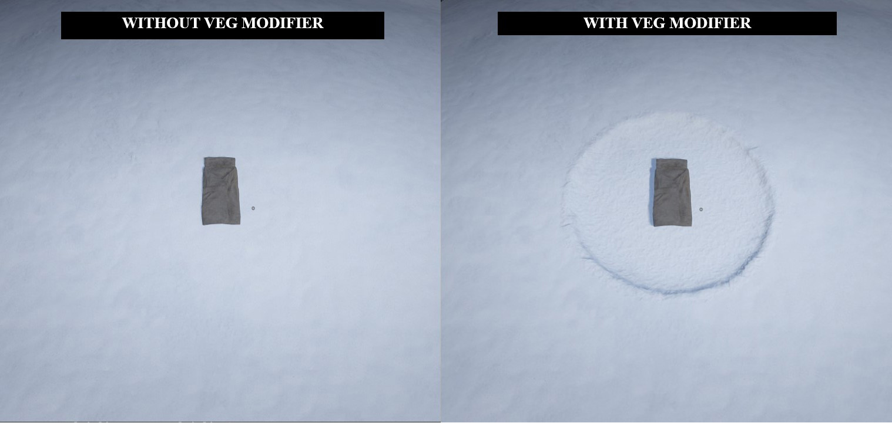
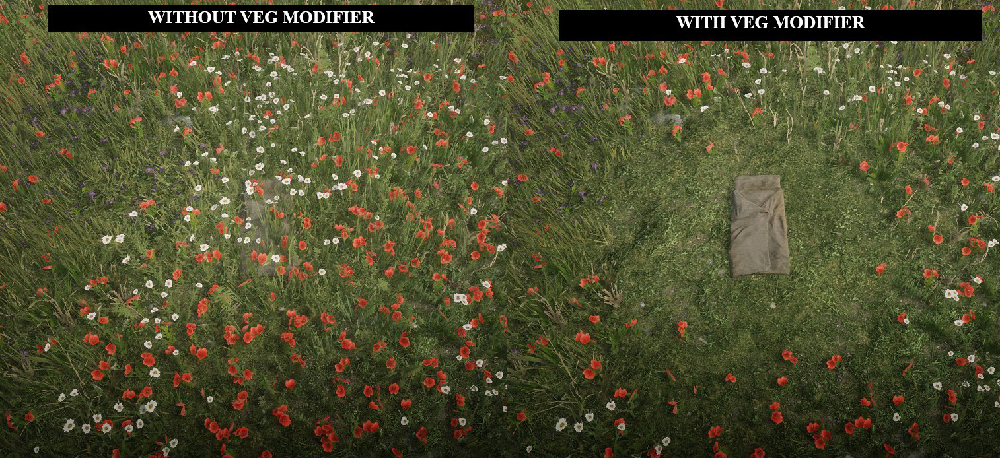

# cdo_terrain_modifier

This is a script designed to remove grass and other map elements to enhance the quality of building structures.

It's a straightforward implementation with user-friendly configuration options, based in:

https://github.com/femga/rdr3_discoveries/tree/master/graphics/veg_modifier

